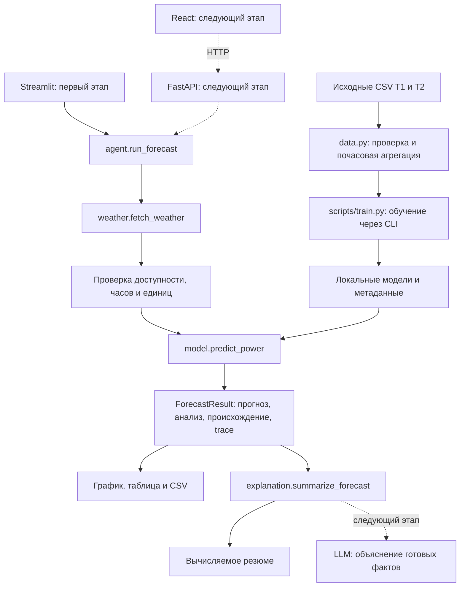

# Интеграция ML-модели, бэкенда, фронтенда и LLM

Этот документ определяет, какие данные передают друг другу компоненты прогноза ВЭС, что должен выдать этап обучения и как подключить его результат к интерфейсу. Его можно передать разработчикам модели, API и фронтенда до начала обучения.

**Статус на 23 сентября 2026:** после подготовки этой спецификации пользователь отдельно разрешил быстрое локальное обучение. Реализованы `contracts.py` (границы обучения), `data.py`, `model.py`, CLI обучения и smoke-проверки; обе модели обучены. Фактические результаты, артефакты и команды — в [README.md](README.md). Погодный адаптер, полный агент, UI, LLM и HTTP-маршруты ниже по-прежнему описывают будущую реализацию.

## 1. Основания и границы

- [AGENTS.md](AGENTS.md) задаёт правила реализации; [PLAN.md, раздел 9](PLAN.md#9-shared-contracts) — имена публичных функций и JSON-поля. Этот документ сохраняет их.
- Предоставленный файл `HackAlem AI_ Agentic AI для прогнозирования выработки ВЭС.md` — требования организатора: почасовой прогноз на 24–48 часов и воспроизведение февраля с погодными прогнозами, доступными в момент расчёта.
- `deep-research-report.md` — исследовательские рекомендации. Предложения об ансамбле LightGBM/CatBoost/XGBoost, общей модели двух турбин и LLM-оркестраторе не считаются принятым изменением архитектуры. Его оценки качества не являются результатами нашей модели.
- Исходный запрос был подготовить документ до обучения. Последующий запрос отдельно разрешил локальное обучение двух моделей; React/FastAPI, живая погода и платные LLM-вызовы в него не входят.

Первый этап из плана: один Python-процесс, Streamlit, две отдельно обученные модели на реальных измерениях, синтетическая погода, явно вымышленные координаты и вычисляемое текстовое резюме. Следующий этап: React обращается к тонкому FastAPI-слою, который вызывает те же Python-функции; LLM подключается через отдельный адаптер объяснения. Полный архивный replay февраля остаётся отдельной задачей.

## 2. Общая схема и ответственность



| Компонент | Получает | Возвращает / делает |
|---|---|---|
| `contracts.py` | Публичные типы и правила | Общие схемы запросов, результатов, времени, ошибок и CSV |
| `data.py` | Два исходных CSV | Проверенную почасовую историю и аудит исключений |
| `scripts/train.py` + `model.py` | Историю и фиксированный cutoff | Обученные артефакты T1/T2; загрузку и численный прогноз |
| `weather.py` | Зарегистрированный объект, origin, горизонт, режим | Манифест происхождения и почасовые погодные признаки |
| `agent.py` | `ForecastRequest` | Проверяет входы, получает погоду, вызывает модель, считает анализ, управляет кэшем и trace |
| `app.py`, позднее React | Реестр объектов, запрос и результат | Выбор турбины, управление расчётом, визуализацию и состояние интерфейса |
| Будущий HTTP-слой | JSON-запрос | Сериализует вызовы существующего ядра; хранит результаты для объяснений/экспорта |
| `explanation.py` | Успешный `ForecastResult` | Резюме с привязкой к fingerprint; сначала шаблон, позднее LLM |

Модель не знает про HTTP, карту, LLM или Streamlit. Фронтенд не загружает ML-артефакт и не собирает признаки. В первом этапе агент — ограниченный программный процесс с фиксированными проверками. LLM отвечает только за объяснение.

## 3. Время, идентичность и единицы

| Поле / понятие | Правило |
|---|---|
| `turbine_id` | Только зарегистрированные `T1` и `T2`; каждая связана со своим источником и моделью |
| `origin` | Явный момент расчёта, ISO 8601 с часовым поясом; нормализуется в UTC, минуты/секунды равны нулю |
| `horizon_hours` | Целое число `24` или `48`; строки и логические значения не принимаются |
| `valid_at` | Начало прогнозируемого часового интервала в UTC |
| `lead_hour` | Целые значения от `1` до `horizon_hours` |
| Целевые часы | `valid_at = origin + lead_hour × 1h`; первая строка всегда `origin + 1h` |
| `power_norm` | Средняя нормализованная мощность за час, доля `[0, 1]` |
| `baseline_norm` | Последняя допустимая измеренная почасовая мощность, повторённая на весь горизонт |
| Погода | `wind_speed_ms` в м/с; `temperature_c` в °C |
| Отображение | Время переводится в `timezone` из реестра; API и CSV сохраняют UTC |

Зафиксированные примеры:

- Первый origin: `2026-01-31T18:00:00Z` = 31 января, 23:00 `Asia/Almaty`.
- Первый прогнозируемый интервал: `[2026-01-31T19:00:00Z, 2026-01-31T20:00:00Z)` = 1 февраля, 00:00–01:00 местного времени.
- Последнее начало часа для 24 часов: `2026-02-01T18:00:00Z`; для 48: `2026-02-02T18:00:00Z`.
- Кнопка «Следующий день» переводит origin в `2026-02-01T18:00:00Z` и запускает новый расчёт. Текущая календарная дата компьютера не используется.

В интерфейсе допустимо показывать `0.42` как `42%` при явной подписи «нормализованная мощность»; JSON/CSV сохраняют `0.42`. Не называть эту величину МВт, МВт·ч или процентом паспортной мощности: знаменатель нормализации неизвестен. Не суммировать две турбины в физическую мощность станции без мощностей установок и метаданных нормализации.

## 4. Данные для будущего обучения

При подготовке спецификации исходники прочитаны из `/Users/dzalilabutalip/Downloads/`. Проверены количество строк, диапазон исходных временных меток, отсутствие их дубликатов и SHA-256. Для последующего обучения созданы неизменённые копии в `data/`; исходники в Downloads не изменялись.

| ID | Точный файл | Строк без заголовка | Период исходного времени |
|---|---|---:|---|
| T1 | `Dataset HackAlemAI для участников 11.03.2023-28.02.2026 - turbine 1.csv` | 142 360 | 2023-03-11 00:00 — 2026-01-31 23:50 |
| T2 | `Dataset HackAlemAI для участников 11.03.2023-28.02.2026 - turbine 2.csv` | 149 499 | 2023-03-11 00:00 — 2026-01-31 23:50 |

```text
T1 SHA-256: c4c341582fb2dd348b7187f0128cff265fe055f469413871ebb5db50eef58b5b
T2 SHA-256: 820578cd18bb557cd30c2e102f3ae5a386dfc6c489a5a15743339c2b017305e5
```

В обоих файлах **нет наблюдений за февраль 2026**, хотя названия содержат 28 февраля. Файлы разные; нельзя обучить T1 на копии T2. При подготовке нового окружения разместить исходники в `data/` под точными именами выше, сверить хэши, не объединять повторные загрузки. В текущем checkout копии уже подготовлены и проверены при обучении.

### Преобразование колонок

| CSV | Каноническое поле | Использование |
|---|---|---|
| `ID` | — | Счётчик строк, исключается |
| `Статистическое время` | `timestamp` | Время исходного интервала |
| `Средняя скорость ветра(m/s)` | `wind_speed_ms` | Признак № 1 |
| `Средняя температура окружающей среды(°C)` | `temperature_c` | Признак № 2 |
| `Нормализованная активная мощность` | `power_norm` | Целевая переменная |

Политика подготовки:

1. Читать CSV как UTF-8, разделитель — запятая, десятичный разделитель — точка. Формат времени `%Y-%m-%d %H:%M:%S`; встречаются однозначные часы.
2. Предположить, что исходное время — начало десятиминутного интервала в `Asia/Almaty`. Использовать IANA timezone с историческими изменениями смещения, не фиксированное UTC+5 на весь датасет. Неоднозначные и несуществующие местные времена исключить и посчитать в аудите.
3. Перевести в UTC. Для часа требовать все шесть различных интервалов `:00, :10, :20, :30, :40, :50`; вычислить среднее трёх измерений. Неполные часы исключить. Не интерполировать целевую мощность через пропуски; сохранять нулевую мощность.
4. Исключать и учитывать некорректные строки обучения, включая нечисловые/нефинитные значения; не обрезать целевые метки для маскировки ошибок. Неизвестные единицы требуют разбирательства.
5. Для финального fit оставить только часы с `timestamp + 1h <= 2026-01-31T18:00:00Z`. Самое позднее допустимое начало — `17:00Z`, если этот час полный. Наличие более поздних январских строк не делает их допустимыми для первого origin.
6. Сохранить `data/canonical/history.csv` с полями `turbine_id,timestamp,wind_speed_ms,temperature_c,power_norm` и аудит: хэши, диапазоны, исключённые строки/часы и временные допущения. Генерируемые файлы и артефакты разместить в игнорируемых Git каталогах.

Часовой пояс, смысл начала интервала и знаменатель нормализации пока не подтверждены организатором. Приведённая проверка исходников не заменяет полный аудит и агрегацию при реализации.

## 5. Граница ML ↔ бэкенд

### Модель и признаки первого этапа

По текущему `PLAN.md` обучается отдельный `HistGradientBoostingRegressor(max_iter=100, max_leaf_nodes=15, random_state=42)` для каждой турбины. Замена алгоритма остаётся внутри `model.py`, если публичная схема и доступность признаков сохраняются.

```text
Обучение:
    X: N × 2, столбцы строго [wind_speed_ms, temperature_c]
    y: N, почасовая power_norm на исходной шкале [0, 1]

Инференс:
    X_future: H × 2, тот же порядок и те же единицы, H = 24 или 48
    y_pred: H конечных чисел в том же порядке, что weather_rows
```

`valid_at` используется для проверки и привязки строки, но не входит в численные признаки первого этапа. `turbine_id` выбирает артефакт; `lead_hour` вычисляет агент. Лаги мощности, признаки второй турбины и календарные признаки сейчас не требуются от API или погоды.

Один вызов прогнозирует весь массив часов. Прогноз предыдущего часа не подставляется в следующий. Значения модели проверяются на конечность и затем ограничиваются `[0,1]`; `analysis.clipped_count` отражает число изменённых значений. Нужен внутренний доступ агента к этому счётчику без изменения публичного возврата `predict_power(...)->list[float]`; например, общий внутренний helper может вернуть сырые значения и диагностику. Нельзя повторно обучать или запускать второй независимый fit ради диагностики.

Обучение использует измеренные ветер/температуру, а применение — прогнозные. Это различие источников ограничивает качество; проверка на измеренной погоде не доказывает качество архивного прогноза. Будущая модель с лагами или NWP-признаками потребует новой внутренней версии схемы признаков и согласования с владельцем погодного адаптера.

### Что передаёт разработчик модели

Предлагаемая локальная структура артефакта, дополняющая `PLAN.md`:

```text
artifacts/models/T1/<model_digest>/model.pkl
artifacts/models/T1/<model_digest>/metadata.json
artifacts/models/T2/<model_digest>/model.pkl
artifacts/models/T2/<model_digest>/metadata.json
```

Это внутреннее размещение, не часть HTTP-контракта. `model_digest` — хэш без префикса `sha256:`; публичный `model_id` имеет этот префикс. Загрузчик выбирает артефакт только через серверный реестр и проверяет совпадение ID турбины, схемы признаков и метаданных.

Обязательные сведения в `metadata.json` для передачи бэкенду:

| Поле | Содержание |
|---|---|
| `artifact_schema_version`, `model_id`, `turbine_id` | Версия внутреннего формата и идентичность |
| `estimator`, `parameters`, `feature_names`, `feature_units` | Алгоритм, параметры, точный порядок двух признаков и единицы |
| `target`, `target_unit` | `power_norm`, `normalized_fraction` |
| `train_cutoff`, `train_last_interval_start`, `training_rows` | Cutoff, фактический последний обучающий час, число использованных часов |
| `source_sha256`, `canonical_sha256`, `artifact_sha256` | Хэши исходника своей турбины, использованных канонических данных и файла модели |
| `timezone_assumption`, `interval_semantics`, `aggregation_policy` | Временные допущения и правило шести интервалов |
| `baseline_norm`, `baseline_interval_start` | Последнее допустимое наблюдение этой турбины и его час |
| `python_version`, `library_versions` | Окружение, в котором артефакт был создан |
| `validation` | Период/метод проверки, тип погодных входов, метрики и число проверенных строк; `null`, пока проверки нет |

`model_id` учитывает обучающие строки своей турбины, порядок и преобразования признаков, параметры и cutoff. Добавить версию реализации/окружения для однозначности воспроизведения. Если метод подготовки или модель изменились, меняется идентификатор.

Бэкенд загружает доверенные локально созданные артефакты при старте или первом обращении и переиспользует их по `model_id`. Фронтенд и LLM не получают бинарные файлы. Отсутствующий, повреждённый или несовместимый артефакт даёт `MODEL_UNAVAILABLE`; запрос прогноза не запускает обучение.

### Публичные Python-интерфейсы

Сигнатуры из `PLAN.md` сохраняются; `contracts.py` описывает границы, реализации находятся в профильных модулях:

```python
# weather.py
fetch_weather(site: dict, origin: str, horizon_hours: int, mode: str) -> dict

# model.py
train_model(history: pandas.DataFrame, origin: str, turbine_id: str) -> object
predict_power(model: object, weather_rows: list[dict]) -> list[float]

# agent.py
run_forecast(request: dict) -> dict

# explanation.py
summarize_forecast(result: dict, backend: str = "template") -> dict
```

Это декларации интерфейсов, не исполняемый пример. Сохранение/загрузка модели и диагностика могут использовать внутренние helpers. `train_model` вызывается из CLI. Зарезервированный `replay_month(mode: str, output_path: str) -> dict` относится к будущему replay и не нужен для одиночного прогноза.

## 6. Граница погода ↔ агент ↔ модель

`fetch_weather` получает объект из серверного реестра `sites.csv` (`turbine_id,latitude,longitude,timezone`) и возвращает:

```text
{
  manifest: {
    run_id, provider, source_url, retrieved_at,
    initialized_at, available_at, availability_basis,
    provenance_status, raw_sha256, interpolation
  },
  rows: [{valid_at, wind_speed_ms, temperature_c}, ...]
}
```

Это описание полей; полный JSON результата прогноза приведён ниже. Манифест хранится вместе с исходным ответом погоды. `provenance_status` принимает `verified|unverified|fixture`; `interpolation` — `none|linear_3h_to_1h`. Единицы нормализуются в адаптере и фиксируются в документации источника до вызова модели.

Перед обращением к кэшу вычисленного прогноза агент проверяет:

1. Объект зарегистрирован, координаты взяты из конфигурации, модель принадлежит ему.
2. `initialized_at <= available_at <= origin`. Время запуска погодной модели не равно моменту публикации; `retrieved_at` не доказывает историческую доступность.
3. Получен один подходящий run с полным покрытием целевого окна. Строки уникальны, отсортированы, их ровно H, и каждая соответствует `origin + lead_hour × 1h`.
4. Ветер и температура конечны, присутствуют и имеют известные единицы; скорость ветра неотрицательна. Пропущенное значение на инференсе не заменяется средним или нулём.
5. `fixture` явно маркируется как синтетическая погода. `archive` требует проверенного operational/as-issued источника; `unverified` не проходит как подтверждённый архив, а fixture/reanalysis/фактическая будущая погода не подставляются автоматически.

Для будущего трёхчасового архивного источника допустима линейная интерполяция внутри одного run с опорными точками, охватывающими всё окно. Экстраполяция и склейка разных run запрещены. Если источник даёт U/V-компоненты, скорость вычисляется до интерполяции. Доступность конкретного архива и высоты погодных переменных ещё нужно проверить; этот документ не подтверждает ни одного живого погодного endpoint.

Сетевой бюджет по плану: timeout 10 секунд на попытку, один повтор; затем подходящий проверенный локальный погодный кэш либо явная ошибка. Погодный кэш тоже проходит проверки времени, происхождения и покрытия. В первом этапе без реализованного архива `mode=archive` возвращает `WEATHER_UNAVAILABLE`.

## 7. Контракт запроса и результата

### ForecastRequest

```json
{
  "turbine_id": "T2",
  "origin": "2026-01-31T18:00:00Z",
  "horizon_hours": 24,
  "mode": "fixture"
}
```

Все четыре поля обязательны. `mode` принимает `fixture|archive` и описывает происхождение погоды. Оба режима используют реальные обучающие измерения. Модель выбирает сервер по турбине; координаты, массив признаков и желаемые значения прогноза не передаются клиентом.

### ForecastResult: успешный ответ

Следующий пример — **полный демонстрационный JSON на 24 часа с вручную заданными числами для чтения контракта**. Он не получен от обученной модели, не является наблюдениями или доказательством качества. `sha256:example-*` обозначают места будущих настоящих хэшей. В рабочем ответе `hours` содержит ровно запрошенные 24 или 48 строк.

```json
{
  "status": "ok",
  "mode": "fixture",
  "turbine_id": "T2",
  "origin": "2026-01-31T18:00:00Z",
  "horizon_hours": 24,
  "timezone": "Asia/Almaty",
  "run_id": "fixture-r1",
  "model_id": "sha256:example-model-t2",
  "fingerprint": "sha256:example-forecast-t2-24",
  "cache_hit": false,
  "train_last_interval_start": "2026-01-31T17:00:00Z",
  "weather_provenance": {
    "initialized_at": "2026-01-31T06:00:00Z",
    "available_at": "2026-01-31T14:00:00Z",
    "source_url": "fixture://r1",
    "availability_basis": "synthetic",
    "provenance_status": "fixture"
  },
  "hours": [
    {"valid_at":"2026-01-31T19:00:00Z","lead_hour":1,"power_norm":0.42,"baseline_norm":0.31,"wind_speed_ms":7.2,"temperature_c":-5},
    {"valid_at":"2026-01-31T20:00:00Z","lead_hour":2,"power_norm":0.44,"baseline_norm":0.31,"wind_speed_ms":7.4,"temperature_c":-5},
    {"valid_at":"2026-01-31T21:00:00Z","lead_hour":3,"power_norm":0.46,"baseline_norm":0.31,"wind_speed_ms":7.6,"temperature_c":-5},
    {"valid_at":"2026-01-31T22:00:00Z","lead_hour":4,"power_norm":0.48,"baseline_norm":0.31,"wind_speed_ms":7.8,"temperature_c":-5},
    {"valid_at":"2026-01-31T23:00:00Z","lead_hour":5,"power_norm":0.49,"baseline_norm":0.31,"wind_speed_ms":7.9,"temperature_c":-5},
    {"valid_at":"2026-02-01T00:00:00Z","lead_hour":6,"power_norm":0.5,"baseline_norm":0.31,"wind_speed_ms":8,"temperature_c":-5},
    {"valid_at":"2026-02-01T01:00:00Z","lead_hour":7,"power_norm":0.48,"baseline_norm":0.31,"wind_speed_ms":7.8,"temperature_c":-5},
    {"valid_at":"2026-02-01T02:00:00Z","lead_hour":8,"power_norm":0.46,"baseline_norm":0.31,"wind_speed_ms":7.6,"temperature_c":-5},
    {"valid_at":"2026-02-01T03:00:00Z","lead_hour":9,"power_norm":0.42,"baseline_norm":0.31,"wind_speed_ms":7.2,"temperature_c":-5},
    {"valid_at":"2026-02-01T04:00:00Z","lead_hour":10,"power_norm":0.38,"baseline_norm":0.31,"wind_speed_ms":6.8,"temperature_c":-5},
    {"valid_at":"2026-02-01T05:00:00Z","lead_hour":11,"power_norm":0.34,"baseline_norm":0.31,"wind_speed_ms":6.4,"temperature_c":-5},
    {"valid_at":"2026-02-01T06:00:00Z","lead_hour":12,"power_norm":0.3,"baseline_norm":0.31,"wind_speed_ms":6,"temperature_c":-5},
    {"valid_at":"2026-02-01T07:00:00Z","lead_hour":13,"power_norm":0.26,"baseline_norm":0.31,"wind_speed_ms":5.6,"temperature_c":-5},
    {"valid_at":"2026-02-01T08:00:00Z","lead_hour":14,"power_norm":0.22,"baseline_norm":0.31,"wind_speed_ms":5.2,"temperature_c":-5},
    {"valid_at":"2026-02-01T09:00:00Z","lead_hour":15,"power_norm":0.18,"baseline_norm":0.31,"wind_speed_ms":4.8,"temperature_c":-5},
    {"valid_at":"2026-02-01T10:00:00Z","lead_hour":16,"power_norm":0.14,"baseline_norm":0.31,"wind_speed_ms":4.4,"temperature_c":-5},
    {"valid_at":"2026-02-01T11:00:00Z","lead_hour":17,"power_norm":0.13,"baseline_norm":0.31,"wind_speed_ms":4.3,"temperature_c":-5},
    {"valid_at":"2026-02-01T12:00:00Z","lead_hour":18,"power_norm":0.12,"baseline_norm":0.31,"wind_speed_ms":4.2,"temperature_c":-5},
    {"valid_at":"2026-02-01T13:00:00Z","lead_hour":19,"power_norm":0.15,"baseline_norm":0.31,"wind_speed_ms":4.5,"temperature_c":-5},
    {"valid_at":"2026-02-01T14:00:00Z","lead_hour":20,"power_norm":0.18,"baseline_norm":0.31,"wind_speed_ms":4.8,"temperature_c":-5},
    {"valid_at":"2026-02-01T15:00:00Z","lead_hour":21,"power_norm":0.22,"baseline_norm":0.31,"wind_speed_ms":5.2,"temperature_c":-5},
    {"valid_at":"2026-02-01T16:00:00Z","lead_hour":22,"power_norm":0.27,"baseline_norm":0.31,"wind_speed_ms":5.7,"temperature_c":-5},
    {"valid_at":"2026-02-01T17:00:00Z","lead_hour":23,"power_norm":0.32,"baseline_norm":0.31,"wind_speed_ms":6.2,"temperature_c":-5},
    {"valid_at":"2026-02-01T18:00:00Z","lead_hour":24,"power_norm":0.38,"baseline_norm":0.31,"wind_speed_ms":6.8,"temperature_c":-5}
  ],
  "analysis": {
    "peak_power_norm": 0.5,
    "peak_at": "2026-02-01T00:00:00Z",
    "min_power_norm": 0.12,
    "min_at": "2026-02-01T12:00:00Z",
    "clipped_count": 0,
    "warnings": [
      "Real turbine training data; synthetic weather",
      "Timezone and interval semantics assumed",
      "Fictional fixture coordinates"
    ]
  },
  "trace": [
    {
      "step": "validate_request",
      "status": "ok",
      "detail": "T2; 24 target hours"
    },
    {
      "step": "load_model",
      "status": "ok",
      "detail": "T2 model selected"
    },
    {
      "step": "fetch_weather",
      "status": "ok",
      "detail": "fixture-r1 selected"
    },
    {
      "step": "validate_weather",
      "status": "ok",
      "detail": "24 unique eligible hours; finite features"
    },
    {
      "step": "prepare_features",
      "status": "ok",
      "detail": "wind_speed_ms, temperature_c"
    },
    {
      "step": "predict_power",
      "status": "ok",
      "detail": "24 finite predictions; 0 clipped"
    },
    {
      "step": "analyze",
      "status": "ok",
      "detail": "Peak and minimum computed"
    }
  ]
}
```

| Поля результата | Как использовать |
|---|---|
| `status`, `mode`, `turbine_id`, `origin`, `horizon_hours`, `timezone` | Проверить соответствие активному запросу; подписать объект, время и режим |
| `model_id`, `train_last_interval_start` | Показать версию модели и последний использованный обучающий час |
| `run_id`, `weather_provenance` | Показать погодный run, время доступности и ограничения происхождения |
| `fingerprint`, `cache_hit` | Связать прогноз, объяснение, экспорт; сообщить о повторном использовании результата |
| `hours` | Общий источник для графика мощности, baseline, погоды и таблицы |
| `analysis` | Серверные факты для UI и резюме; фронтенд не пересчитывает их для другого подмножества молча |
| `trace` | Фактически выполненные шаги и причины ошибок/выбора/переиспользования |

`peak_power_norm`/`min_power_norm` вычисляются по итоговым значениям всего горизонта. При равенстве выбирается самый ранний час. `baseline_norm` остаётся замороженной последней допустимой измеренной мощностью до первого origin, в том числе при продвижении в февраль. Это «frozen persistence», без новых февральских наблюдений.

Trace строится во время исполнения. При попадании в кэш нельзя записывать, будто модель только что выполнялась: фиксируется проверка входов и реальное переиспользование. Пример выше показывает один возможный порядок шагов, а не список фиктивных успешных событий для копирования.

### Ошибка прогноза

```json
{
  "status": "error",
  "code": "WEATHER_UNAVAILABLE",
  "message": "Нет допустимого погодного прогноза на все 24 целевых часа для указанного origin.",
  "trace": [
    {"step": "fetch_weather", "status": "error", "detail": "Не найден подходящий run"}
  ]
}
```

| Код | Смысл | Поведение интерфейса |
|---|---|---|
| `INVALID_INPUT` | Неизвестная турбина, неверные origin/horizon/mode | Показать ошибку входа, не запускать последующие шаги |
| `WEATHER_UNAVAILABLE` | Нет доступного и покрывающего окно run; не удалось получить допустимый архив | Показать причину; не заменять погоду выдуманными значениями |
| `DATA_INVALID` | Повреждённый погодный bundle, пропуски/дубликаты/нефинитные признаки, некорректный численный выход | Прервать текущий расчёт, показать проблему данных |
| `MODEL_UNAVAILABLE` | Нет подходящего артефакта или он не загружается | Предложить подготовить модель через CLI; не обучать из UI |

Ошибка не содержит успешного массива `hours`. Старый результат не подставляется в неё и не отображается как результат нового запроса.

### CSV

Фиксированный заголовок из `PLAN.md`:

```csv
turbine_id,origin,valid_at,lead_hour,power_norm,baseline_norm,run_id,model_id,mode,provenance_status
```

UTF-8, десятичная точка, UTC ISO-время, строки в порядке `lead_hour`. CSV содержит тот же набор H прогнозов, что и график, с тем же `fingerprint` в имени файла; дроби не превращаются в проценты. `mode` и `provenance_status` сохраняются в каждой строке.

## 8. Будущий HTTP-слой для React

**Предложение для следующего этапа. Эти маршруты ещё не реализованы и не добавляют HTTP-зависимость в ядро.** Владелец A фиксирует их при старте бэкенда; до этого реализация идёт через Python-контракты выше.

| Маршрут | Запрос | Успешный ответ |
|---|---|---|
| `GET /api/v1/sites?mode=fixture` | Режим реестра, `fixture` или `archive` | `{ "sites": [...] }` для карты и селектора |
| `POST /api/v1/forecasts` | Ровно `ForecastRequest` | `ForecastResult` без обёртки; HTTP 200 |
| `POST /api/v1/summaries` | `{ "forecast_fingerprint": "sha256:…", "backend": "template" }` | `SummaryResult` из раздела 9; HTTP 200 |
| `GET /api/v1/forecasts/{fingerprint}/csv` | Fingerprint успешного результата | `text/csv; charset=utf-8`, скачивание файла |

Предлагаемый формат элемента реестра:

```json
{
  "sites": [
    {
      "turbine_id": "T2",
      "latitude": 0.0,
      "longitude": 0.0,
      "timezone": "Asia/Almaty",
      "coordinate_provenance": "fixture",
      "model_id": null,
      "can_predict": false,
      "unavailable_reason": "MODEL_UNAVAILABLE"
    }
  ]
}
```

`0.0,0.0` здесь — явно вымышленная координата, не расположение ВЭС. Реестр возвращает обе настроенные турбины; показана одна. Для реальной карты владелец A проверяет координаты из ссылок организатора. Значения `coordinate_provenance`: `fixture|verified|unverified`; неизвестные реальные координаты не становятся рабочими маркерами. `can_predict` означает готовность зарегистрированного объекта и модели для режима; доступность погоды на конкретный origin проверяется при расчёте.

HTTP-обработчик прогноза вызывает `run_forecast(body)` и сохраняет только успешный результат по его fingerprint в локальном ограниченном кэше процесса. Объяснение и экспорт используют этот серверный результат. Клиент не присылает произвольный `analysis` или `hours` для пересказа LLM.

Если после перезапуска/вытеснения fingerprint отсутствует, summary/export возвращает HTTP 404 с существующей формой ошибки: `status=error`, `code=INVALID_INPUT`, понятным `message` и `trace=[]`. UI повторно запрашивает прогноз по сохранённому `ForecastRequest`. База данных и очередь для этого этапа не нужны.

Остальные HTTP-соответствия: `INVALID_INPUT` → 422, `DATA_INVALID` → 422, `WEATHER_UNAVAILABLE` → 503, `MODEL_UNAVAILABLE` → 503. Валидацию JSON в API нужно привести к общей форме ошибки, а не оставлять отдельный формат фреймворка. Сетевой сбой или неожиданный ответ сервера также переводит UI в ошибку; подробности исключений и секреты не выдаются клиенту.

Браузерный timeout прогноза должен покрывать две погодные попытки до 10 секунд каждая и время вычисления; предложенный начальный бюджет — 30 секунд. Резюме запрашивается отдельно и не задерживает показ мощности. При отдельных origin фронтенда и API разрешаются только нужные CORS-origin. Runtime-модель и погодная конфигурация находятся на сервере.

## 9. Граница бэкенд ↔ LLM

### SummaryResult

И Streamlit, и будущий API используют неизменную форму:

```json
{
  "text": "Прогнозируемый максимум нормализованной мощности — 0.50 в 05:00 1 февраля, минимум — 0.12 в 17:00 1 февраля (Asia/Almaty). Использована синтетическая погода; часовой пояс и смысл исходных интервалов пока приняты как допущение.",
  "backend": "template",
  "forecast_fingerprint": "sha256:example-forecast-t2-24",
  "warning": null
}
```

Текст примера соответствует демонстрационному `ForecastResult` выше. `backend` обозначает фактический источник текста: `template` или `llm`, независимо от запрошенного режима.

Последовательность:

1. Сначала показать успешный прогноз и вычисляемое резюме из `analysis`. Шаблон содержит 2–3 предложения, время в timezone объекта, нормализованные единицы и существенные ограничения.
2. На следующем этапе, если LLM включена, передать через серверный адаптер только успешные прогнозные строки, вычисленный анализ, timezone/единицы и необходимое происхождение. Не отправлять исходные обучающие CSV, модель, ключи или внутренние пути.
3. Сделать не более одного LLM-запроса на новое резюме, timeout 8 секунд, автоматические повторы отключены. Форматирование ограничить 100 словами. Конкретные настройки поддерживаемой модели проверить при подключении провайдера; этот документ не подтверждает доступность какой-либо модели аккаунту.
4. При отсутствии ключа, timeout, ошибке провайдера, пустом/незавершённом ответе или провале проверки фактов вернуть готовый template с `backend=template` и поясняющим `warning`. Успешный прогноз сохраняет `status=ok`; HTTP summary остаётся 200 с полезным fallback-текстом.

Инструкция для будущего LLM-адаптера:

```text
Составь краткое объяснение на русском по переданному прогнозу.
Используй только его рассчитанные факты и часы в указанном часовом поясе.
Назови максимум, минимум и ограничения источника погоды.
Не генерируй и не изменяй почасовую мощность, новые числа, метрики точности,
причины аномалий или оценки уверенности. Значения — нормализованные доли.
Если погода синтетическая, прямо укажи это. Не более 100 слов.
```

Промпт не заменяет контроль результата. До замены шаблона адаптер проверяет упомянутые величины/времена по серверным фактам и сохранение маркировки fixture; если надёжно подтвердить текст нельзя, оставляет template. Сведения из внешних текстовых полей считаются данными, не инструкциями. LLM не получает инструменты для обучения, изменения origin, выбора другого погодного режима или обхода проверок.

Конфигурация по плану: `SUMMARY_BACKEND=template` по умолчанию; будущие `OPENAI_API_KEY` и `OPENAI_MODEL` — только переменные окружения серверного процесса. В template-режиме ключ и SDK провайдера не нужны. В React ключи не попадают, в том числе через публичные build-переменные.

Кэш резюме: fingerprint прогноза + запрошенный backend + ID LLM-модели + версия промпта. При смене прогноза старое объяснение теряет актуальность. Будущие вопросы пользователя ограничиваются текущим результатом; произвольный чат не входит в первый этап.

## 10. Поведение фронтенда и согласованность результата

1. Загрузить доступные объекты. Изначально объект не выбран, расчёт отключён. Выбор маркера или синхронизированного селектора задаёт `turbine_id`; клик по фону, панорамирование и масштабирование не запускают прогноз.
2. При смене объекта, origin, горизонта или режима немедленно убрать признак актуальности старого результата, скрыть его резюме и отключить экспорт как текущего. Исторический результат можно оставить только с явной подписью, к какому запросу он относится.
3. По кнопке «Рассчитать» зафиксировать снимок запроса и локальный номер обращения; перейти в состояние загрузки. Повторное нажатие во время текущего расчёта блокируется.
4. Принять ответ только для всё ещё активного снимка запроса/номера обращения. Отменять старый сетевой запрос полезно, но проверка номера нужна даже при отмене: поздний ответ предыдущей турбины не должен перезаписывать новую.
5. Для `status=ok` показать график, таблицу, baseline, погоду, происхождение, предупреждения и CSV. Отдельно получить резюме и показать его, только если `forecast_fingerprint` совпал с текущим результатом и обращение ещё актуально.
6. Для ошибки очистить актуальный результат и показать причину. Сбой LLM влияет только на резюме; сбой погоды не превращается в успешный прогноз из старого кэша.
7. «Следующий день» увеличивает origin на 24 часа и повторяет процесс. В первом этапе fixture предусмотрены два demo-origin; за пределами доступных fixtures показывается ошибка. Сравнение обновлений возможно только для одинаковой турбины, режима и пересекающихся `valid_at`.

Минимальные UI-состояния: `idle → loading → success|error`; изменение контролов переводит показанный результат в `stale`. Состояние резюме (`loading|template|llm`) отдельно от состояния прогноза. Для Streamlit состояние хранится в session state, для React — во фронтенде; ядро от них не зависит.

Постоянные подписи для fixture: «Обучение на реальных данных турбин; погода синтетическая», «Координаты вымышленные», «Исторический сценарий». Происхождение текста также видно: «Вычисляемое резюме» или «Объяснение LLM». При недоступной карте селектор объектов сохраняет рабочий путь.

## 11. Кэш и повторный расчёт

Сначала проверить запрос и актуальный допустимый погодный bundle, затем искать вычисленный результат. Повторный запрос вправе использовать подходящий локальный погодный кэш, но не пропускать проверки доступности.

```text
fingerprint = SHA256(canonical_json(
    normalized_request,
    model_id,
    registered_site_identity_and_coordinates,
    normalized_sorted_weather_rows,
    meaningful_weather_provenance
))
```

Значимое происхождение включает provider/run, initialized/available time, основание доступности, статус проверки, raw hash, определение/единицы погодных переменных и политику интерполяции. Реестр включает timezone и происхождение координат. UTC-время и единицы приводятся к единому виду до хэширования; NaN/Infinity запрещены, порядок сериализации стабилен.

Из fingerprint исключаются `retrieved_at`, длительность выполнения, `cache_hit` и trace. Повторная загрузка неизменного содержимого не должна создавать другой прогноз. Изменение origin, горизонта, турбины, режима, модели, конфигурации объекта, значимых погодных данных или их происхождения меняет fingerprint.

`cache_hit` и trace описывают текущее обращение, даже если числа взяты из кэша. Внутренняя принудительная перезагрузка погоды не отменяет проверок и не добавляет незадокументированное поле в `ForecastRequest`.

## 12. Порядок реализации и передача между разработчиками

| Поток | Первый результат после этой спецификации | Что передаёт другим |
|---|---|---|
| A: интеграция/погода | `contracts.py`, реестр, fixture weather, `run_forecast`, ошибки/кэш | Стабильные JSON-контракты и проверяемые сценарии; позднее — подтверждённый архив и HTTP-слой |
| B: данные/модель | Аудит и почасовая история, CLI обучения, два ML-артефакта и загрузчик | Артефакты с metadata, порядок признаков, model ID, фактические результаты проверки |
| C: интерфейс/объяснение | Streamlit по тем же контрактам и computed template | Карта/селектор, графики, экспорт, защита от устаревшего результата; позднее — React и LLM-адаптер |

Изменения публичных схем и общих зависимостей координирует A. Эта таблица распределяет ответственность разработчиков, но не запускает дополнительные агенты.

Последовательность сборки:

1. Реализовать типы/валидацию из разделов 3, 6 и 7; при начале HTTP-работы зафиксировать предложение из раздела 8.
2. Подготовить окружение, неизменённые исходники, `.gitignore`, аудит, агрегацию и CLI. Выполнить отдельное обучение T1/T2 с указанным cutoff и сохранить metadata.
3. Подключить загрузчик моделей, две синтетические погодные выдачи для двух demo-origin, агент, проверки и вычисляемое резюме.
4. Подключить Streamlit и проверить весь путь, включая ошибки. После работающего первого этапа отдельно переходить к архиву, HTTP/React и LLM.

Планируемые команды из `AGENTS.md` после появления перечисленных модулей:

```sh
python3 -m venv .venv
source .venv/bin/activate
python -m pip install -r requirements.txt
python -m scripts.make_fixtures
python -m scripts.train --mode fixture
python -m pytest -q
DATA_MODE=fixture SUMMARY_BACKEND=template python -m streamlit run app.py
```

В плане предусмотрен Python 3.11+; фактическое обучение проверено на Python 3.14.7. `requirements.txt`, обучение и тесты уже реализованы, но `scripts.make_fixtures` и `app.py` ещё отсутствуют, поэтому весь блок выше **не является готовой инструкцией запуска приложения**. Рабочие команды обучения/проверки приведены в [README.md](README.md). `--mode fixture` не означает обучение финальных моделей на выдуманных измерениях.

## 13. Проверки перед передачей интеграции

- Источники T1/T2 различаются; хэши и число строк зафиксированы; шесть интервалов, временные неоднозначности, пропуски и cutoff проверены. Ни один обучающий час не заканчивается после первого origin.
- Инференс проверен для `T1/T2 × 24/48 часов × двух demo-origin`: восемь комбинаций, ровно H последовательных конечных прогнозов в `[0,1]`. Не требовать конкретных значений от обученного регрессора.
- Модель загружается без повторного fit; турбины получают разные model ID. Неверный порядок/единицы признаков, отсутствие артефакта и повреждённые данные не дают успешный ответ.
- Погода с будущим `available_at`, пропущенным/дублированным часом, NaN/Infinity и неверным режимом отклоняется, в том числе при наличии старого кэшированного успеха.
- Одинаковые нормализованные входы сохраняют fingerprint; смена модели, origin, погоды или значимого происхождения его меняет. Изменение только времени получения не меняет прогноз.
- График, таблица и CSV содержат одинаковые часы и числа. Пик/минимум и tie-breaking в summary соответствуют всему результату. Нет единиц МВт/МВт·ч и неподтверждённых метрик точности.
- Поздний ответ старого запроса и резюме с другим fingerprint не отображаются как текущие. Ошибка погоды убирает актуальный успех, ошибка LLM оставляет прогноз и помеченный template.
- Fixture/weather, вымышленные координаты и происхождение резюме видны пользователю и не маскируются под live-данные или LLM. При недоступных map tiles работает селектор.
- При появлении HTTP проверены маршруты, JSON-ошибки, отсутствующий fingerprint, CSV и политика origin. При появлении LLM — timeout/fallback, проверка фактов и отсутствие ключа в клиенте.

Февральские MAE/RMSE нельзя вычислить без отдельно предоставленной истины. Январский хронологический holdout должен использовать только более ранние обучающие часы; любые fitted-преобразования обучаются на его train-части. Проверка на измеренной погоде маркируется как диагностика преобразования «погода → мощность», не как доказанная точность будущего прогноза.

**До обучения остаются допущения:** timezone/семантика интервала и нормализация. **До реального архивного демо:** подтверждённые координаты, operational-погодный архив с доказательством доступности, полный replay 28 origin для обеих турбин и честный отчёт о покрытии/отсутствующей истине. Наличие этого документа или работающего fixture-демо не означает выполнения всей задачи организатора.
