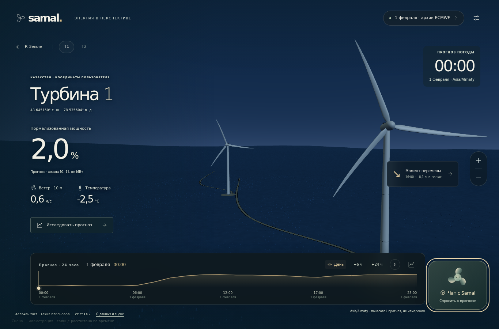

# Samal — прогноз мощности ВЭС

Русскоязычное приложение React + FastAPI воспроизводит прогнозирование за **1–28 февраля 2026 года**. Выберите T1/T2, день февраля и 24/48 часов. Сервер берёт операционный погодный выпуск ECMWF, доступный до исторического момента решения, пишет CSV, модель читает этот файл и прогнозирует нормализованную мощность. График, таблица, объяснение и чат используют один сохранённый результат. Текущий прогноз доступен отдельно.



**Готово:** 56 из 56 запусков, 2 688 строк на 48 часов и 1 344 строки непрерывного февраля — по 672 часа на турбину. Независимый аудит прошёл 289 проверок. После переноса моделей оба итоговых CSV воспроизвелись побайтно. [CSV, отчёт, модели, входы и погодные свидетельства](deliverables/february_2026_operational/README.md). Фактической мощности февраля в исходных данных нет: MAE/RMSE этого периода не заявляются.

## Быстрый запуск

Для готовых моделей нужны **Python 3.14** и совместимые версии зависимостей из `bundle_manifest.json`; Node.js 22+. Python 3.12+ поддерживается кодом, но готовые pickle-модели требуют совместимой среды; для другой версии модели следует переобучить.

```sh
python3.14 -m venv .venv
. .venv/bin/activate
python -m pip install -r requirements.txt
mkdir -p artifacts
cp -R deliverables/february_2026_operational/artifacts/models artifacts/models
python -m scripts.fetch_operational_weather --workers 4
npm --prefix frontend ci
npm --prefix frontend run build
python -m uvicorn backend.api:app --host 127.0.0.1 --port 8000
```

Копирование моделей предназначено для свежего клона без `artifacts/models`. Откройте <http://localhost:8000>; API — <http://localhost:8000/docs>. Загрузка архивной погоды требует сети; повторные расчёты используют проверенный кеш. В поставку включены погодные свидетельства, но не исходные GRIB: их получает команда загрузки. Если архив отсутствует или повреждён, сервер выдаёт ошибку без подмены текущей/фактической погодой.

Для разработки интерфейса отдельно запустите `npm --prefix frontend run dev`: Vite на порту 5173 проксирует `/api` в FastAPI на 8000. Не добавляйте ключи в VITE-переменные. В этом приватном репозитории по явному запросу владельца предоставлен серверный `.env` **только для проверки жюри**. Он включает настройку OpenAI; не переносите ключ во frontend и не распространяйте за пределами приватного репозитория. Без ключа доступны явно обозначенные расчётные ответы.

## Весь период одной командой

После загрузки погоды и установки моделей:

```sh
python -m scripts.jury_run --cache-only
```

Команда проверяет кеш, выполняет 56 прогнозов и сохраняет CSV, `report.json`, `audit.json` в `artifacts/february_operational`. Без `--cache-only` она также загружает архив. Для нового переносимого комплекта добавьте `--package-dir artifacts/submission/new_february`; каталог должен ещё не существовать. Здесь нет обучения или платных вызовов LLM.

## Сценарий показа

1. Выберите февральский режим, T1, 1 февраля и 48 часов. Origin — 31 января 23:00 Asia/Almaty (18:00 UTC); первый прогнозный час — 1 февраля 00:00.
2. Покажите источник ECMWF, дату инициализации и серверное время доступности архивного объекта до origin. Сегодняшнее скачивание не считается исторической публикацией.
3. Откройте график мощности и ветра, почасовую таблицу; скачайте прогноз и точный входной CSV модели. Мощность нормализована [0,1], не МВт/МВт·ч.
4. Спросите «Найди лучшие четыре часа подряд», затем «А какой там ветер?». Разговор сохраняет выбранный период.
5. Перейдите к 2 февраля: origin теперь 1 февраля. Повторите для T2 и 24 часов. Смена даты/турбины/горизонта очищает прежний контекст.
6. Выберите 28 февраля, 48 часов: результат включает 1 марта. Непрерывный месячный CSV берёт первые 24 часа каждого запуска и содержит только февраль.

3D-сцена иллюстративна: положение солнца вычисляется по времени и координатам, обороты визуально реагируют на прогнозный ветер. Это не телеметрия оборудования. При недоступном WebGL расчёт и чат сохраняются.

## Устройство проекта

| Путь | Ответственность |
|---|---|
| `frontend/src/` | Samal, сцена, выбор даты, график, таблица, чат и HTTP-клиент |
| `backend/api.py`, `backend/services/february.py` | HTTP, исторические даты, хранение результата и CSV |
| `backend/services/agent.py` | Погода → канонический CSV → модель → численный анализ |
| `backend/adapters/operational_weather.py` | Операционные GRIB, хеши, серверные метаданные и почасовой вход |
| `backend/ml/` | Исходные данные, схема CSV, отдельные модели T1/T2 |
| `backend/services/forecast_tools.py`, `backend/adapters/explanation.py` | Численные инструменты диалога и необязательный OpenAI |
| `scripts/` | Подготовка, обучение, replay, аудит и упаковка |
| `legacy/` | Прежний Streamlit; не активный интерфейс |

LLM не создаёт и не меняет прогноз мощности. Анализ и вопросы принимают серверный forecast ID. Прогнозы сохраняются с контрольной суммой: до 256 файлов на семь дней; сервер рассчитан на один процесс. Контракты: [CONTRACTS.md](CONTRACTS.md).

## Данные, проверка и ограничения

Истории T1/T2 содержат 142 360/149 499 строк и заканчиваются 31 января 2026 года несмотря на имена файлов. Дополнительные материалы не содержат фактической мощности февраля. Обучение заморожено на завершённых часах до `2026-01-31T18:00:00Z`.

Операционный архив проверен по серверным датам каждого использованного объекта, идентичности GRIB и хешам. На каждый из 28 выпусков сохранены 17 индексов и 51 выбранное GRIB-сообщение из 34 объектов провайдера. Сетка — 0,25°; компоненты ветра и температура интерполируются с трёхчасового шага до почасового. Обе близкие турбины могут попадать в одну погодную ячейку, но используют разные модели мощности. Источник и разрешение отличаются от погодного ряда обучения: происхождение подтверждено, точность мощности на феврале не оценена.

Проверены полный replay и 289 пунктов аудита; в реальном браузере — Samal, T2/48 часов, T1/24 часа, последовательные вопросы по четырёхчасовому периоду, настольная и мобильная ширина без ошибок JavaScript. 44 целевые backend-проверки и 17 frontend-проверок прошли. Платных LLM-проверок в этом прогоне не было; расчётный чат проверен отдельно от качества ответов OpenAI.

Подробнее: [февральский процесс](docs/february-replay.md), [критерии жюри](docs/jury-readiness.md), [модель](FORECASTING_REPORT.md), [данные](DATA_MODEL_HANDOFF.md), [показ](DEMO_CHECKLIST.md).

## Подготовка моделей с нуля

```sh
python -m scripts.fetch_training_weather --start-date 2024-01-01 --end-date 2026-01-31
python -m scripts.train_forecast --activate
```

Обучение требует сети и времени, выполняется только через CLI. Исходные CSV не меняются. Для дальнейшей оценки нужны фактическая мощность февраля и уточнение временных границ/нормировки SCADA у владельца данных.

Прежний условный результат Open-Meteo Single Runs оставлен только для воспроизводимости в [старом комплекте](deliverables/february_2026/README.md). Он не заменяет основной операционный результат и не повышается автоматически до `verified`.
